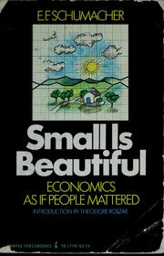
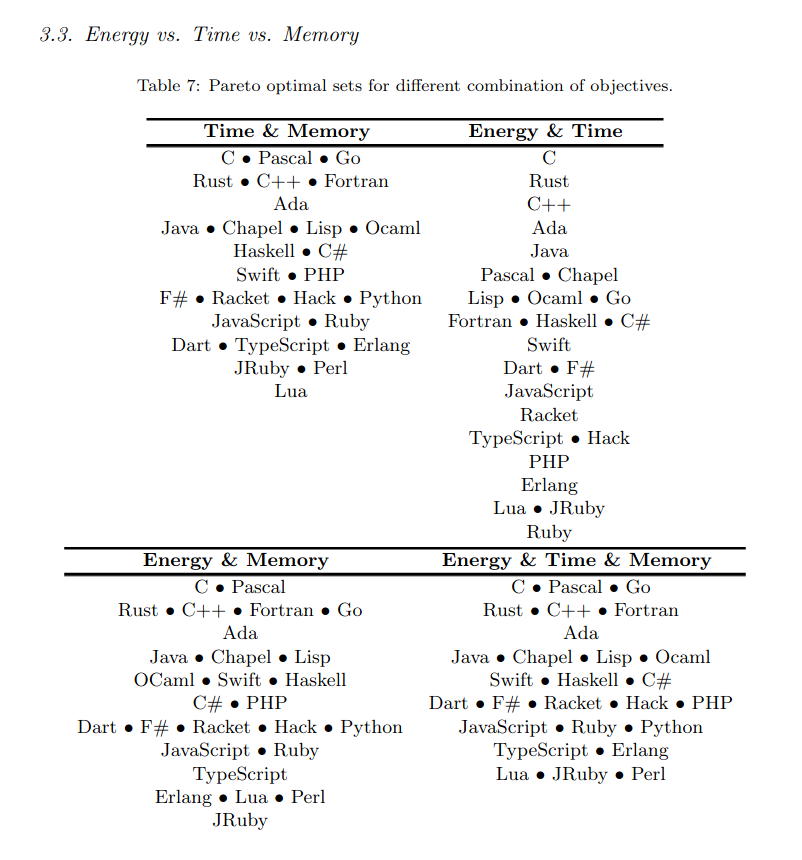
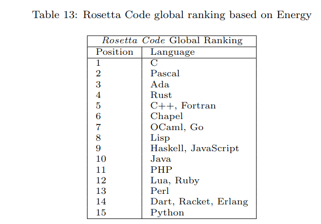

# Go energy efficiency

> Lightning Talk, [Leipzig Gophers](https://golangleipzig.space) [#32](https://golangleipzig.space/posts/meetup-32-invitation/), [Martin Czygan](https://www.linkedin.com/in/martin-czygan-58348842), 2022-11-29 19:00 at [Gridfuse](https://gridfuse.com) Leipzig

## Document [52021PC0558](https://eur-lex.europa.eu/legal-content/EN/TXT/?uri=CELEX:52021PC0558)

> ... to transform the EU into a fair and prosperous society, with a modern,
> resource-efficient and competitive economy where there are no net emissions
> of greenhouse gases in **2050** and where economic growth is **decoupled from
> resource use** [...] To reach these objectives, "energy efficiency must be prioritised".

Cf. [Small is beautiful: economics as if people mattered](https://openlibrary.org/works/OL1622912W/Small_Is_Beautiful) (1973) -- found via [Cloud Native Go](https://www.oreilly.com/library/view/cloud-native-go/9781492076322/)

[](https://openlibrary.org/works/OL1622912W/Small_Is_Beautiful)

> Let us take a closer look at this 'natural capital'. First of all, and most
> obviously, there are the **fossil fuels**. No-one, I am sure, will deny that
> we are treating them as **income** items although they are undeniably
> **capital** items.

> **If we treated them as capital items, we should be concerned with
> conservation: we should do everything in our power to try and minimise their
> current rate of use**; we might be saying, for instance, that the money
> obtained from the realisation of these assets - these irreplaceable assets -
> must be placed into a special fund to be devoted exclusively to the evolution
> of production methods and patterns of living which do not depend on fossil
> fuels at all or depend on them only to a very slight extent.

## It's simple

> Energy efficiency simply means using less energy to perform the same task –
> that is, eliminating energy waste. --
> [https://www.eesi.org/topics/energy-efficiency/description](https://www.eesi.org/topics/energy-efficiency/description)

Many papers and whitepapers discussing EE:

* [Digitalization and energy consumption. Does ICT reduce energy demand?](https://fatcat.wiki/release/27wghdxkvvg5lfzk3vqs7vpxp4) (2020, cited [by 50+](https://fatcat.wiki/release/27wghdxkvvg5lfzk3vqs7vpxp4/refs-in))

## Anecdata

> Previously, we needed two servers, now with Go one is more than enough.

> We replaced a previous service with a Go implementation and we require 1/8 of the resources.

Personally:

* "big data on a budget" projects, processing TBs w/o a cluster (e.g. [A data
  web service](https://github.com/miku/dwstalk), [Fuzzy Matching with Command Line Tools and Go](https://gist.github.com/miku/fb429faad8b856caf6bba5305af024df), ...)

## Paper

> [Ranking Programming Languages by Energy Efficiency](https://haslab.github.io/SAFER/scp21.pdf)

* 10 tasks (n-body, mandelbrot, binary-trees, ...), 27 languages (functional, OO, imp, scripting)

> While the concern on the computers' energy efficiency started by the hardware
> manufacturers, it quickly became a concern for software developers too [...]

----

📝 Note [2025]: The above study had disclaimers, but also suffered a couple of flaws, as
noted in [It’s Not Easy Being Green: On the Energy Efficiency of Programming
Languages](https://arxiv.org/pdf/2410.05460): *Our analysis suggests that the
choice of programming language implementation has no significant impact on
energy consumption beyond execution time*

----

Using [RAPL](https://en.wikipedia.org/wiki/Perf_(Linux)#RAPL), [LWN545745](https://lwn.net/Articles/545745/) - to collect energy measurements.

Some tools (on Ubuntu): powertop, powercap-utils, ...

```shell
$ cat /boot/config-$(uname -r) | grep RAPL
CONFIG_PERF_EVENTS_INTEL_RAPL=m
CONFIG_PROC_THERMAL_MMIO_RAPL=m
CONFIG_INTEL_RAPL_CORE=m
CONFIG_INTEL_RAPL=m
```

Powertop seems to work w/o RAPL, too.

> RAPL support allows PowerTOP to provide more accurate power measurements. -- [01/powertop](https://01.org/sites/default/files/page/powertop_users_guide_201412.pdf#page=6)

Method: [system](https://man7.org/linux/man-pages/man3/system.3.html) syscall running program, measure via RAPL

## Selected results

| Benchmark      | Position (Go) |
|----------------|---------------|
| binary-tree    | 20/27         |
| fannkuch-redux | 11/27         |
| fasta          | 7/27          |

Normalized - Go at **14/27** - **consuming 3.23x more** than the most efficient
language (C) and only **4-5%** compared to the least efficient languages (Perl,
Python).

| Type        | Consumption (J)|
|-------------|----------------|
| Compiled    | 120            |
| VM          | 576            |
| Interpreted | 2365           |

By paradigm:

| Type       | Consumption (J) |
|------------|-----------------|
| Imperative | 125             |
| OO         | 879             |
| Functional | 1367            |
| Scripting  | 2320            |

## Where Go shines

Category: Lowest peak memory usage.

> The top 5 languages, also presented in Table 4, with the lowest value were: Pascal (66 Mb), Go (69 Mb), C (77 Mb), Fortran (82 Mb), and C++ (88 Mb);

Also in multi-objective ranking:



> In Table 7 we present four multi-objective rankings: time & memory, energy
& time, energy & memory, and energy & time, & memory. For each ranking, each
line represents a Pareto optimal set, or in other words the Pareto front, that
is, a set containing the languages that are equivalent to each other for the
underlying objectives. Simply put, **each line is a single rank or position**.


> The most common performance characteristics of software languages used to
evaluate and choose them are execution time and memory usage. If we consider
these two characteristics in our evaluation, C, Pascal, and Go are equivalent.

Extraordinaire, cette coincidence: Thompson (Bell Labs, C) and Griesemer
(Wirth) are among the designers of Go.

----

> TIL: Chrestomathy, here: Rosetta Code (900 tasks throughout of 700 languages)

> a collection of literary passages, used in the study of language -- C19: from Greek *khrēstomatheia*, from khrēstos useful + mathein to learn

----

There, Go seems to do a bit better.

* 3/15, 5/18, 4/17, 8/21, 9/13 (ackermann), 4/13, 7/17



----

Overall, Go holds its ground in this benchmark - and since we even have
[Generics](https://tip.golang.org/doc/go1.18#generics) since a few months ...
